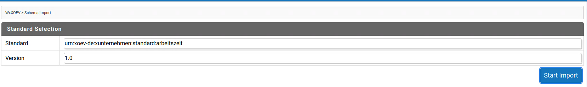
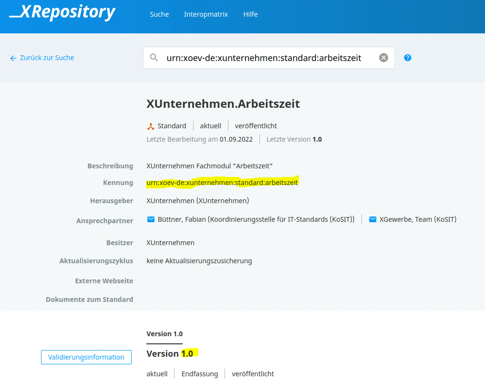
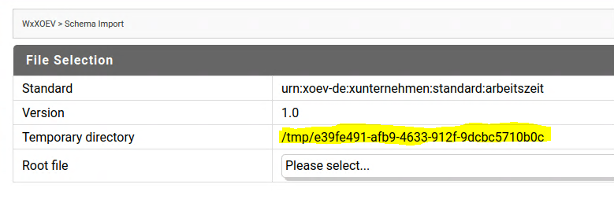
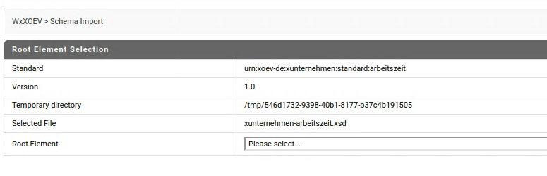
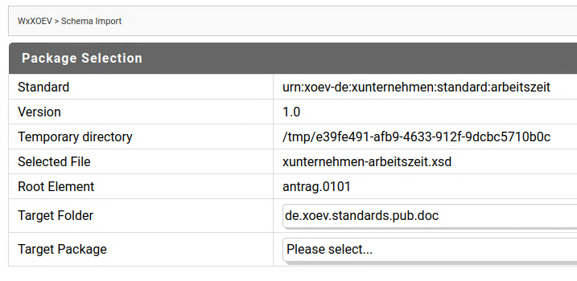
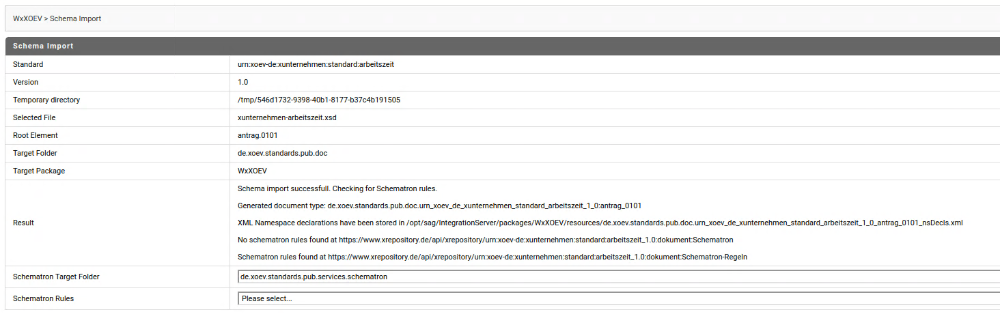
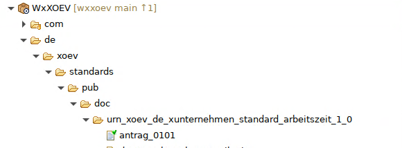
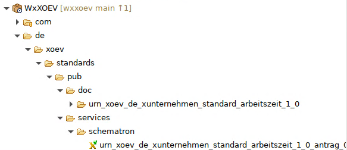
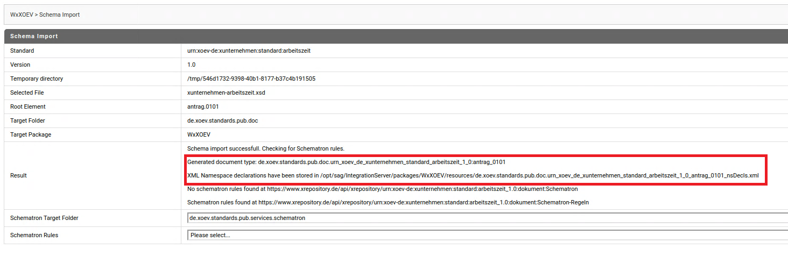
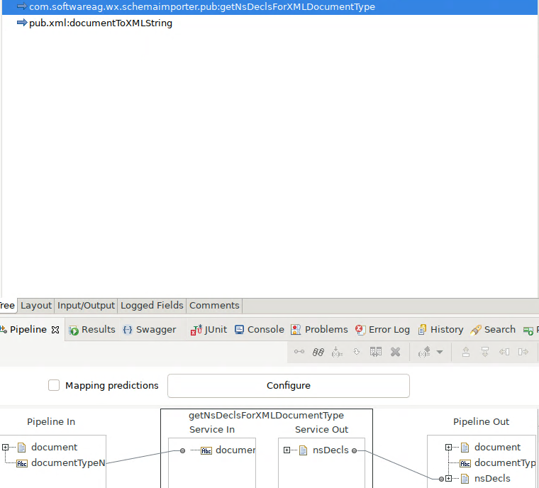

# wxxoev
A module helping with the import of XÖV XML Schemas into webMethods Integration Server.

The main features are:

* Guided import of XML schemas from [xrepository] (www.xrepository.de) based on standard name and version
* Import of schematron rules associated with the imported schema if present in xrepository

## Use Cases

XÖV (Xml in der öffentlichen Verwaltung) is a collection of standards used by german public authorities in the form of XML Schemas. 
If webmethods IntegrationServer is used to process data adhering to these standards, this module can be used to make the import of the XML schemas and creation of document types from them easier.

## Tool Information

### Dependencies

This tool uses WxConfig for configuration purposes which can be obtained via your SoftwareAG Professional Services contact. As this tool only uses a small subset of the WxConfig features, the free [WxConfigLight] (https://github.com/SimonHanischSAG/WxConfigLight) can also be used. 

### Download and Installation

#### MSR Installation

* Clone this repository
* Copy the packages into the container

#### IntegrationServer installation

* Clone this repository
* Build the packages using ABE
* Deploy into the IntegrationServer

### Usage Scenarios

#### Import of XOEV Schemas into Integration Server

* Open the Solution WxXOEV on the IntegrationServer
* Populate the fields standard and version with with the standard name and version obtained from xrepository.
    
    
* Click on Start Import. WxXOEV will download the schemas into a temorary directory from where you can explore the files. 
    
* Select the XSD file containing the XML element (the XOEV message) for which WxXOEV should create IntegrationServer document types from the displayed dropdown list
    
* Select the XML element (the XOEV message) for which WxXOEV should create IntegrationServer document types from the displayed dropdown list
    
* Select the package into which the schema should be imported. Optionally you can modify the folder inside the package to which the schema should be imported 
* WxXOEV imports the schema, shows the results and checks for schematron rules in xrepository
    
* Select the schematron rule xslt to import. Optionally, you can modify the folder inside the package to which the schematron rules will be imported
* As a result, an IntegrationServer document type respresenting the chosen XML element and an XLST service representing the schematron rules are available
    
    

#### Using the Namespace declarations generated by the import

* The import automatically generates a list of namespace declarations for the imported document type and stores it in the resources directory of the package to which the schema is imported.
* The place were this are stored and the fully qualified document type name required to obtain them are shown in the import results

* These can be obtained using the service com.softwareag.wx.schemaimporter.pub:getNsDeclsForXMLDocumentType with the fully qualified document type name as input
    
* And used e.g. with pub.xml:documentToXMLString to ensure that propper xmlns:pfx=... elements are generated in the resulting xml.
    

## Disclaimer

This tool is is not an official Software AG product and as such provided on an as-is basis without any support. Feel free to fork this repository and adapt to your own needs.