# wxxoev
Derived from XÖV (=*X*ML in der *ö*ffentlichen *V*erwaltung) this module helps with the import and use of XML Schemas in the IntegrationServer, focussing on XML Schemas related to public administration. 

The main features are:

* Guided import of XML schemas from [xrepository] (www.xrepository.de) based on standard name and version
* Import of schematron rules associated with the imported schema if present in xrepository
* Import of general XML schemas from files
* Validation of XML documents

## Use Cases

XÖV (Xml in der öffentlichen Verwaltung) is a collection of standards used by german public authorities in the form of XML Schemas. 
If webmethods IntegrationServer is used to process data adhering to these standards, this module can be used to make the import of the XML schemas and creation of document types from them easier.

## Roadmap - Future Features

* Support [FIM Portal](https://fimportal.de) to download FIM schemas in the same automated way as XÖV schemas
* Expose an API for "validation as a service", possibly with on the fly download of missing schemas from xrepository / fim portal

## Tool Information

### Dependencies

This tool uses WxConfig for configuration purposes which can be obtained via your SoftwareAG Professional Services contact. As this tool only uses a small subset of the WxConfig features, the free [WxConfigLight] (https://github.com/SimonHanischSAG/WxConfigLight) can also be used. 

### Download and Installation

#### MSR Installation

* Clone this repository
* Copy the packages into the container

#### IntegrationServer installation

* Clone this repository
* Build the packages using ABE
* Deploy into the IntegrationServer

### Configuration

* The import and valdiation functions (see chapter usage scenarios) rely on schemas and schematron files being imported into a specific namespace (a.k.a folder) in the IntegrationServer. 
* The folders are displayed during import (Target Folder)
    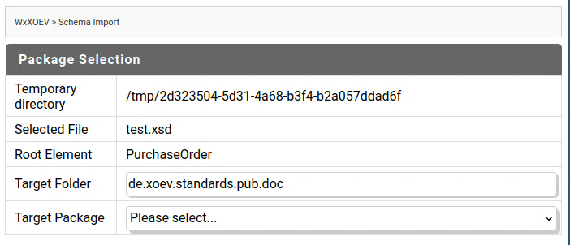
* To set these values, modify the configuration file config/wxconfig.cnf in the package WxXOEV
* wx.xoev.defaults.schemaimport.foldername controls the target for schema imports. Below this folders will be created based on the XML namespace of the schema
* wx.xoev.defaults.schematronimport.foldername controls the target for schematron import. Below this, XSLT services will be generated based on namespace and root element name in the associated schema

### Usage Scenarios

#### Import of general Schemas into Integration Server

* Open the Solution WxXOEV on the IntegrationServer
* Open the function WxXML Schema Import
    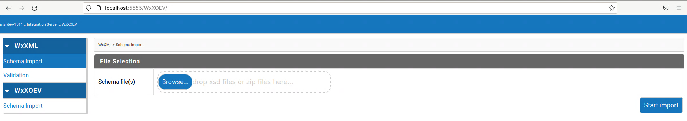
* Drag and drop XSD files to the file upload area and click on start import
    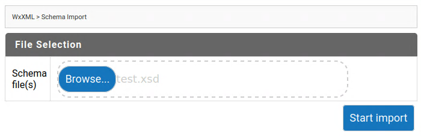
* Select the file containing the root element and the root element
    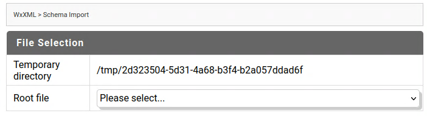
    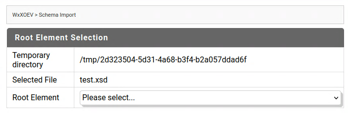
* Select the package into which the schema should be imported. Optionally you can modify the folder inside the package to which the schema should be imported 
    
* WxXOEV imports the schema and shows the results
    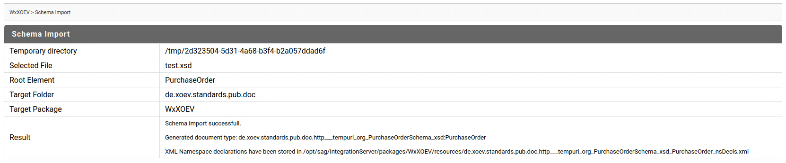

#### Import of XOEV Schemas into Integration Server

XOEV Schemas are hosted in a [xrepository](www.xrepository.de), which is publicly available. Hence WxXOEV offers a convenient way to import schemas from there:

* Open the Solution WxXOEV on the IntegrationServer
* Open the function WxXOEV Schema Import
* Populate the fields standard and version with with the standard name and version obtained from xrepository.
    
    
* Click on Start Import. WxXOEV will download the schemas into a temorary directory from where you can explore the files. 
    
* Select the XSD file containing the XML element (the XOEV message) for which WxXOEV should create IntegrationServer document types from the displayed dropdown list
    
* Select the XML element (the XOEV message) for which WxXOEV should create IntegrationServer document types from the displayed dropdown list
    
* Select the package into which the schema should be imported. Optionally you can modify the folder inside the package to which the schema should be imported 
* WxXOEV imports the schema, shows the results and checks for schematron rules in xrepository
    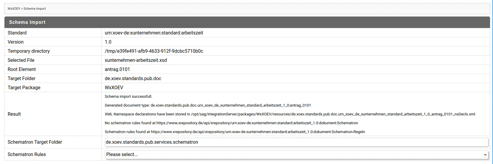
* Select the schematron rule xslt to import. Optionally, you can modify the folder inside the package to which the schematron rules will be imported
* As a result, an IntegrationServer document type respresenting the chosen XML element and an XLST service representing the schematron rules are available
    
    

#### Schema Validation

* Open the Solution WxXOEV on the IntegrationServer
* Open the function WxXML Validation
    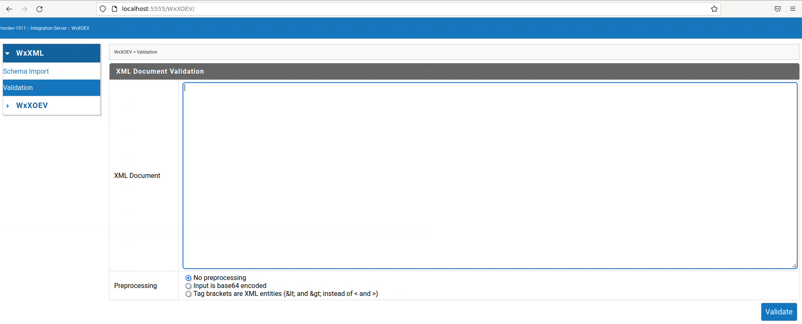
* Paste the XML you want to validate and hit the Validate button
    
* The results will be displayed 
    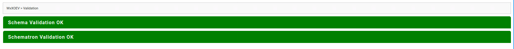
    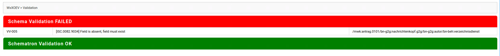
    
* If the schema is unknown, validation will be skipped. As this module specialises on XÖV schemas, it will suggest an import from the XÖV repository based on namespace in of the XML
    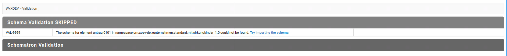
* Following the link in the message will lead to the WxXOEV Schema import
    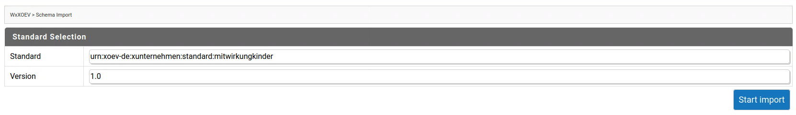

#### Using the Namespace declarations generated by the import

* The import automatically generates a list of namespace declarations for the imported document type and stores it in the resources directory of the package to which the schema is imported.
* The place were this are stored and the fully qualified document type name required to obtain them are shown in the import results
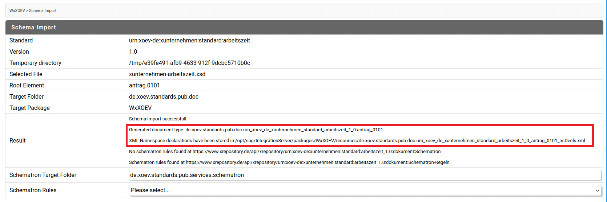
* These can be obtained using the service com.softwareag.wx.schemaimporter.pub:getNsDeclsForXMLDocumentType with the fully qualified document type name as input
    
* And used e.g. with pub.xml:documentToXMLString to ensure that propper xmlns:pfx=... elements are generated in the resulting xml.
    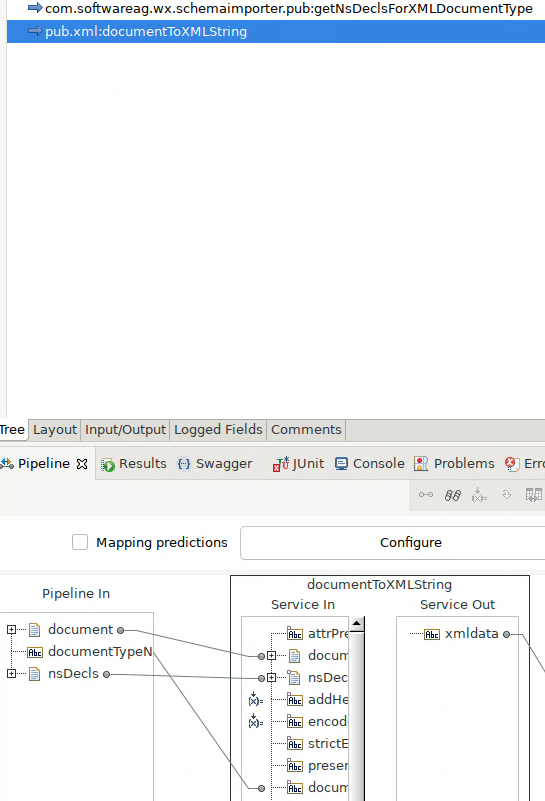

## Disclaimer

This tool is is not an official Software AG product and as such provided on an as-is basis without any support. Feel free to fork this repository and adapt to your own needs.